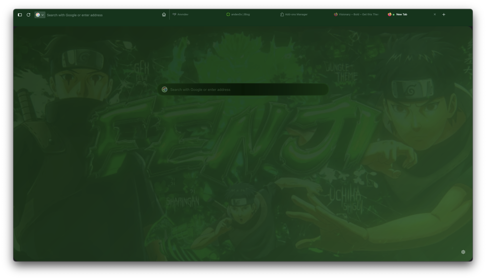
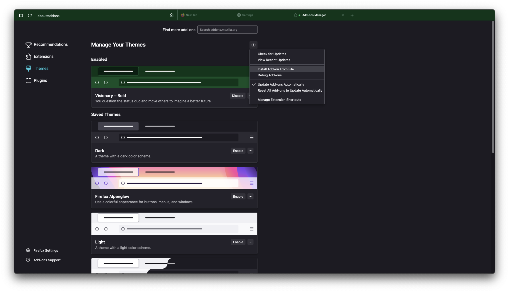
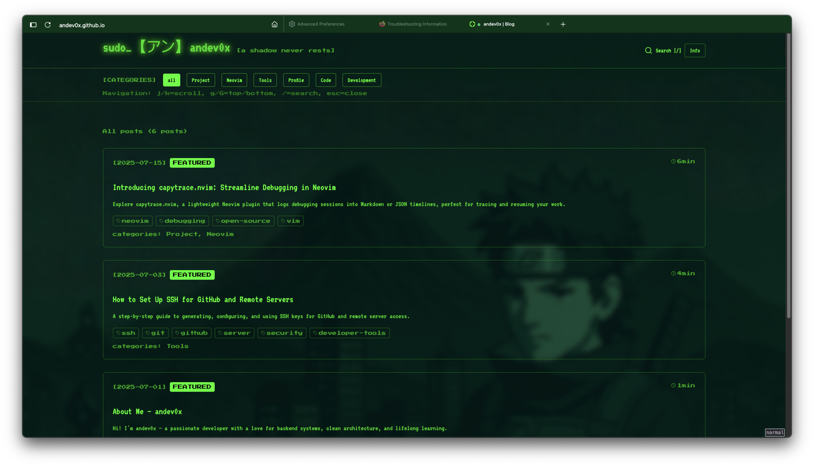

# Minimalist Dark Green – Firefox Interface Customization

Minimalist Dark Green is a custom Firefox theme that transforms your browser into a sleek, modern, and distraction-free environment with a dark green aesthetic. This project leverages Firefox’s powerful userChrome.css and userContent.css capabilities to deliver a unique browsing experience.

## Features

- **Minimalist UI:** Removes unnecessary clutter for a clean, focused interface.
- **Dark Green Palette:** Applies a soothing dark green color scheme throughout the browser.
- **Custom Wallpapers:** Includes a custom wallpaper for the new tab or background.
- **Enhanced Readability:** Adjusts fonts and contrast for comfortable reading.
- **Consistent Styling:** Styles both browser chrome (toolbars, tabs) and web content.

## Installation Instructions

### 1. Enable UserChrome and UserContent Customization

By default, Firefox disables userChrome.css and userContent.css. To enable:

1. Open Firefox and type `about:config` in the address bar.
2. Search for `toolkit.legacyUserProfileCustomizations.stylesheets`.
3. Set it to `true` by double-clicking.

### 2. Locate Your Firefox Profile Folder

1. Go to `about:support` in Firefox.
2. Under "Profile Folder," click "Open Folder."

### 3. Copy the Pre-configured Chrome Folder

This project already includes a pre-configured `chrome` folder with all necessary files. Simply copy the entire `chrome` folder from this project into your Firefox profile folder (the folder you opened in the previous step).

- If a `chrome` folder already exists in your profile, you may overwrite it or back it up first.

### 4. (Optional) Install the Visionary Bold Extension

If you want additional UI enhancements, you can install the included extension:

1. Go to `about:addons` in Firefox.
2. Click the gear icon > "Install Add-on From File..."
3. Select the `import/visionary_bold-2.1.xpi` file.

### 5. Restart Firefox

Close all Firefox windows and reopen the browser to apply the changes.

## Customization Details

- **userChrome.css:**  
  Customizes the browser’s chrome (UI elements like tabs, toolbars, menus) to use a dark green color scheme, reduce visual noise, and streamline the interface.
- **userContent.css:**  
  Applies styles to web content, ensuring a consistent look on internal pages (like new tab, about: pages) and improving readability.
- **wallpaper.png:**  
  Can be set as a background for the new tab or other browser areas, depending on your userChrome/userContent settings.

## Screenshots

See the `docs/` folder for example screenshots (`p1.png`, `p2.png`, `p3.png`).

### Illustrations

## Troubleshooting

- If the theme does not apply, double-check that `toolkit.legacyUserProfileCustomizations.stylesheets` is set to `true` and that the files are in the correct `chrome` folder.
- Some updates to Firefox may override or break custom styles. If this happens, check for updates to this project or consult the Firefox community.

## Credits

- Theme and customization by [anvndev (andev0x on GitHub)](https://github.com/andev0x).
- Visionary Bold extension by its respective author.

## License

This project is licensed under the MIT License. You are free to use, modify, and share this theme. See the [LICENSE](LICENSE) file for details. 